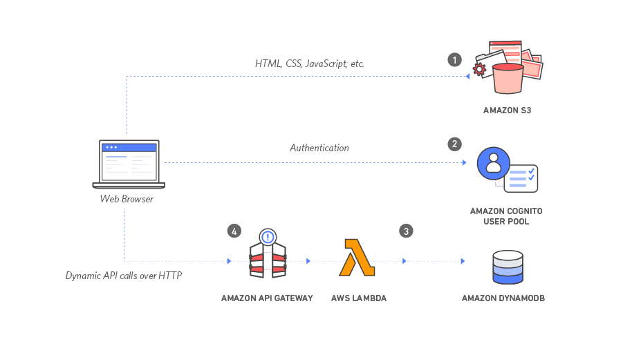

# Serverless Web app using CDK

This use case implements a simple serverless web application. The application will present users with an HTML based user interface for indicating the location where they would like to be picked up and will interface on the backend with a RESTful web service to submit the request and dispatch a nearby unicorn. The application will also provide facilities for users to register with the service and log in before requesting rides.

## Architecture
The application architecture uses AWS Lambda, Amazon API Gateway, Amazon S3, Amazon DynamoDB, and Amazon Cognito as pictured below:


## Deployment steps
Below are the steps to deploy the use case:

```
npm run build

cdk deploy

```

## Deployment Verification
After the stack is deployed successfully, go to the Outputs tab in AWS Cloudformation console of S3StaticWebsiteStack, it should show the 'websiteURL', click on the link and follow the steps below:

* Visit /register.html under your website domain, register youself.

* Verify the registered user email.

* Visit /ride.html under your website domain.

*  If you are redirected to the sign in page, sign in with the user you created in the previous module.

* After the map has loaded, click anywhere on the map to set a pickup location.

* Choose Request Unicorn. You should see a notification in the right sidebar that a unicorn is on its way and then see a unicorn icon fly to your pickup location.

## Reference

[AWS Solution Construct - Serverless Web App ](https://github.com/awslabs/aws-solutions-constructs/tree/main/source/use_cases/aws-serverless-web-app)

## Useful commands

 * `npm run build`   compile typescript to js
 * `npm run watch`   watch for changes and compile
 * `npm run test`    perform the jest unit tests
 * `cdk deploy`      deploy this stack to your default AWS account/region
 * `cdk diff`        compare deployed stack with current state
 * `cdk synth`       emits the synthesized CloudFormation template
